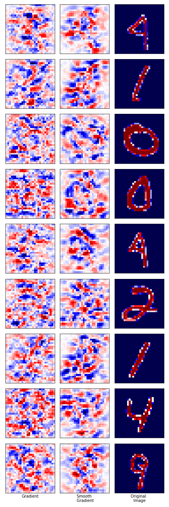

# simple-neural-nets-with-pytorch

Implementation of some neural networks with pytorch.

## Character-level language model
Based on [Andrej Karpathy's blog](http://karpathy.github.io/2015/05/21/rnn-effectiveness/) and [Stanford NLP lecture (cs224N)](http://web.stanford.edu/class/cs224n/).
Here, I implement vanilla recurrent neural network (RNN), long short-term memory (LSTM) and gated recurrent unit (GRU) to generate random text based on `input.text`.
In LSTM, the forget gate bias is initialized to approximately 1, and in GRU, the bias for reset gate is initialized to approximately -1, see this [page](https://danijar.com/tips-for-training-recurrent-neural-networks/).

The RNN models are trained with batches of strings (having length 25) and dropout (0.5).
Sample text after 5000 iterations on Pride and Prejudice  (LSTM, depth=1, hidden state size = 512): 
>      Mr. Darcy believed, you know the whole windownce out as much and I have been proposals; for what I thought as before, seemed to listen a lively, for a lice him
>      only in Hertfordshire a gentlemen and the former concluded and Meryton Gard-nated
>      was
>      found herself he had one than she had been the
>      world. He is uncommon.
Sample text when using depth=2:
>      Miss Bingley and Mr. Collins, let it should you supply such a sensible bagant were distinguished must be so been everything might wish to attisposs you consider what you look ring that the impripeing with them how much a present are, might not mention such as soon from little arrival, I find Lady Catherine, “I could Miss valied the exposing him without loss of your mother’s material good.”

## Variational Autoencoder
Vanilla VAE trained on MNIST data based on Kingma and Welling's [paper]{https://arxiv.org/abs/1312.6114}.
Sample image generated: original (left) vs reconstructed (right) in test set:

    
    

## GAN with maxout
GAN trained on MNIST data based on [paper]{https://arxiv.org/abs/1406.2661} by Goodfellow et al. As in the original paper, I have used maxout layers introduced in this [paper]{https://arxiv.org/abs/1302.4389}.
Sample image generated:

    

Option of using fully connected layers is also provided.

## CNN and saliency map
We train a shallow CNN+Linear model on MNIST data and examine the saliency map. We show the vanilla gradient and the smooth gradient saliency map. The former plots 

where <em>L</em> is the loss and <em>Xij</em> is the <em>ij</em>th pixel of image X.
The latter averages the vanilla gradient saliency map by adding Gaussian noise to each pixel, see this [paper]{https://arxiv.org/abs/1706.03825}.
We also carry out a [sanity check]{https://arxiv.org/abs/1810.03292} by randomizing parameters of the model, and check that the gradient based saliency maps are sensitive to the randomization.

    
    
    
    

From the left: Saliency map of model trained on MNIST.
Saliency map of randomized model (after training on MNIST). 
Saliency map of model trained on only the labels 0 and 1 in MNIST. 
Saliency map of randomized model (after trained on only the labels 0 and 1 in MNIST).
Note that blue (red) in saliency map is negative (positive) in value.   

Let us note that when we train with labels 0 and 1 only, the saliency maps are much easier to interpret, as opposed to saliency maps for model trained on all 10 labels (since in such a case, a more complicated decision process is required).
For example, a typical saliency map for label 1 shows a blue vertical line, which indicates that the loss decreases if the pixel value increase, which makes sense because that is what a typical '1' looks like.
